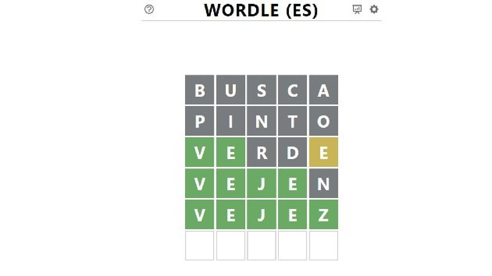

# "Hacking" Wordle

The goal is to obtain the best solution in [wordle](https://wordle.danielfrg.com/), the metric that I'm going to use is the **Shannon entropy**.

$$ S = \sum_{i} -p_{i} log_{2}\left ( p_{i} \right ) $$
## How Wordle works

The goal of the game is to find the daily word. We have 6 tries and the word lenght is 5 characters.

When we make a try every letter is going to be colored, if the color is  green means that the letter is correct , if it is orange means that the letter is in the word but not in that position and finally if the letter is grey, the letter is not contained on the word.
